# HuoYu

HuoYu 是一个面向个人主页的动态展示站点，前台用于集中展示个人资料、社交入口、技能栈、游戏、音乐、阅读、项目、GitHub 与 WakaTime 数据；后台用于维护站点资料、项目展示和页脚信息。

项目已从 ZeroHome 更名为 HuoYu，后台入口统一为 `/admin`。

## 功能特性

- 个人首页：头像、昵称、标语、社交链接、技能图标和主页视觉动效。
- 内容卡片：阅读清单、Steam、WeGame、网易云音乐、GitHub 提交、WakaTime 编程时长、MBTI 与项目展示。
- 项目展示：同步 GitHub 公开仓库，显示语言、语言颜色、仓库标签、Star/Fork、源码和预览入口。
- 数据缓存：外部 API 数据统一走缓存策略，减少刷新时的接口压力。
- 主题体验：前台支持日间与夜间模式，日间为绿叶草地氛围，夜间为异火流星氛围。
- 管理后台：通过 `/admin` 输入 `PASSWORD` 登录，支持站点标题、favicon、个人资料、项目与页脚配置。
- 国际化：前台和后台都提供语言切换入口。

## 预览

### 日间模式

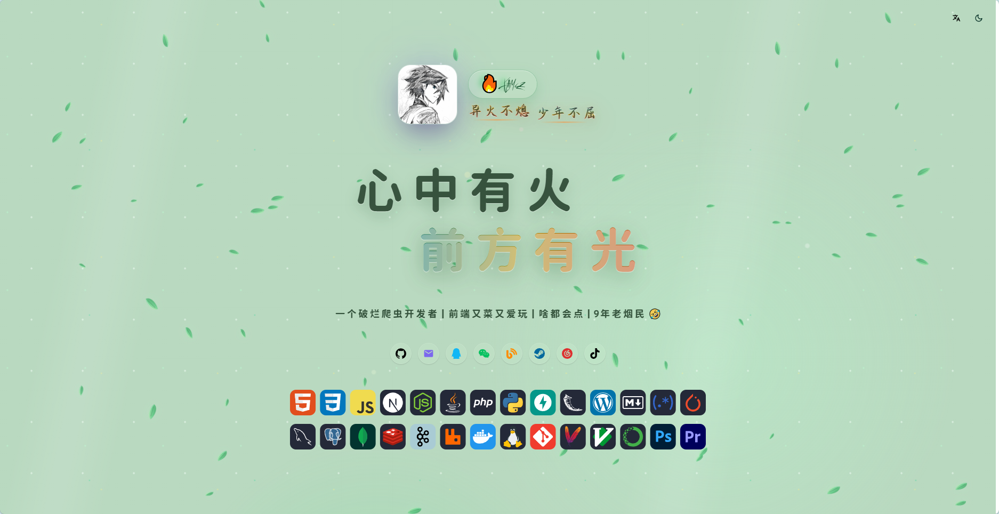

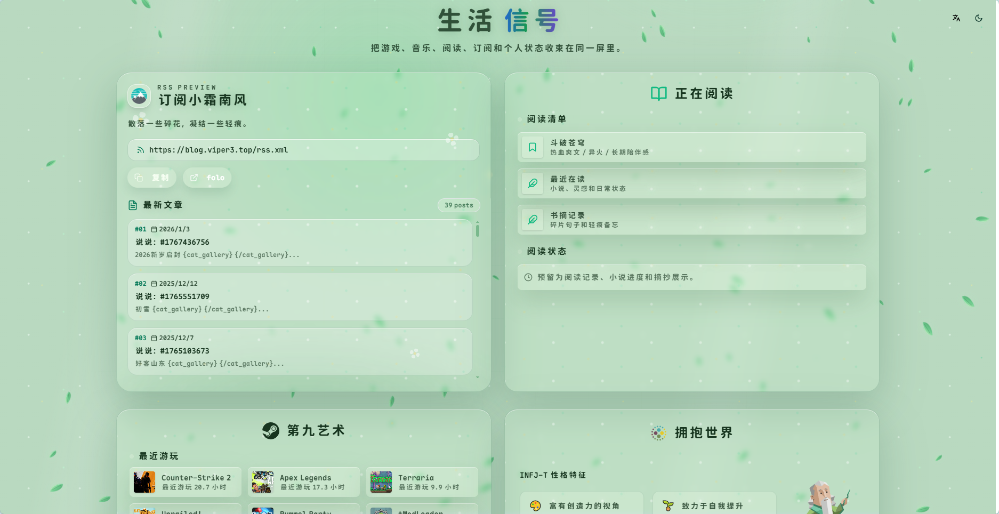

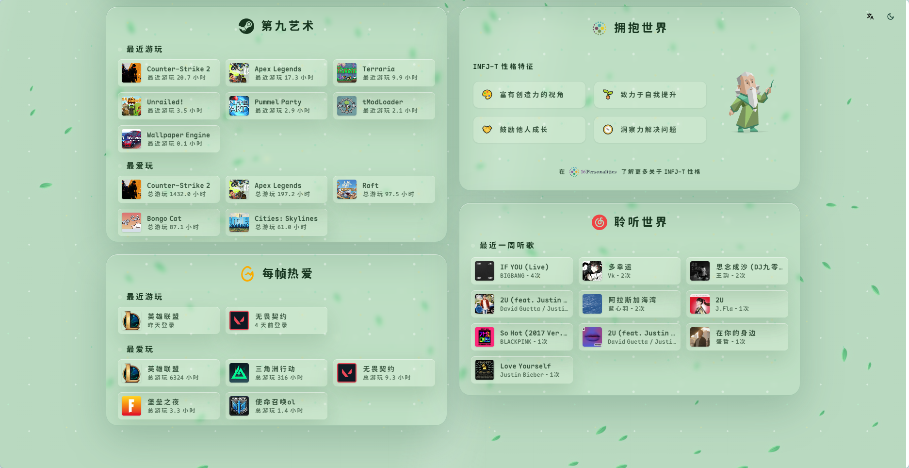

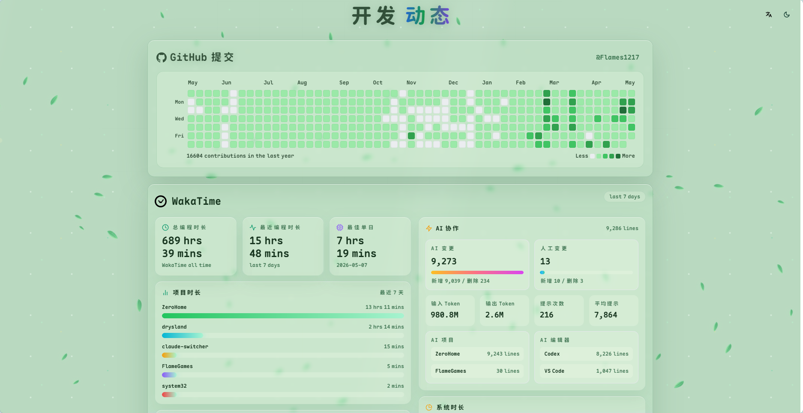

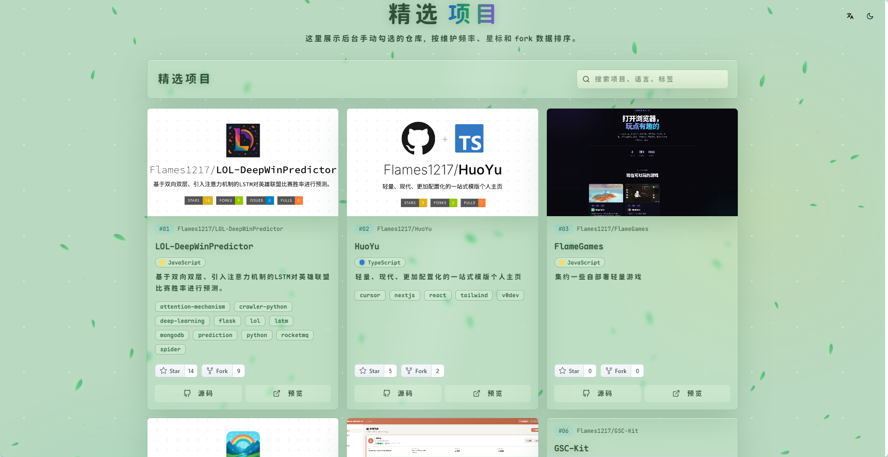

### 夜间模式

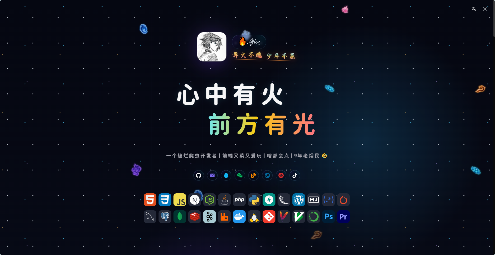

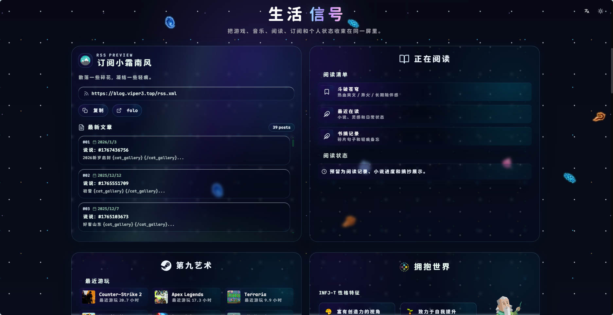

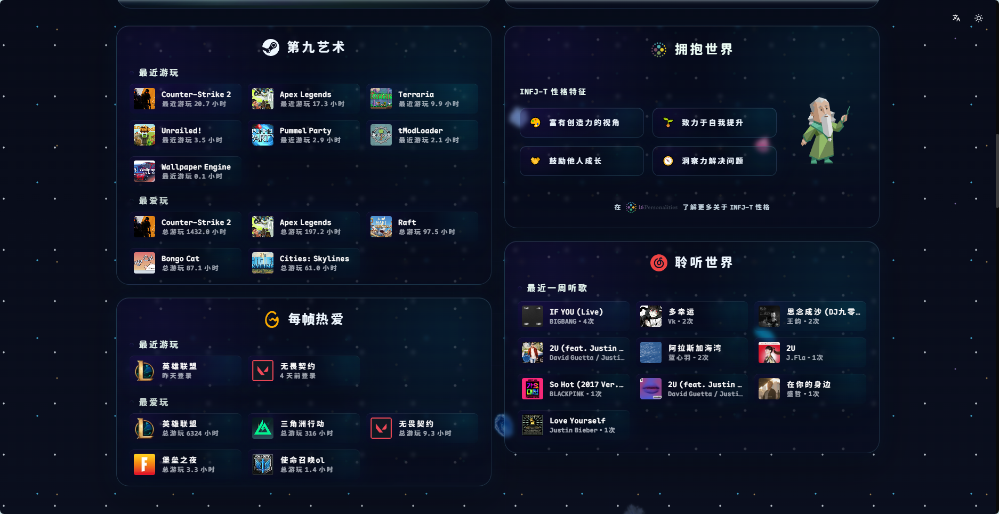

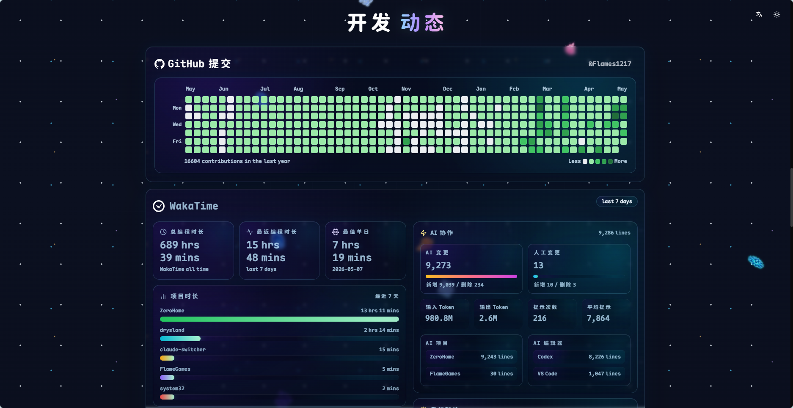

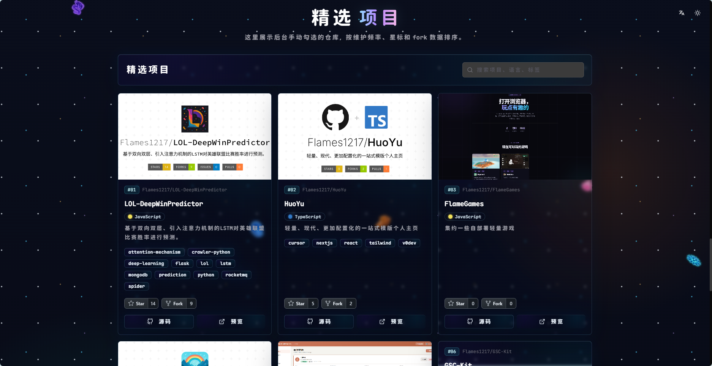

### 后台管理

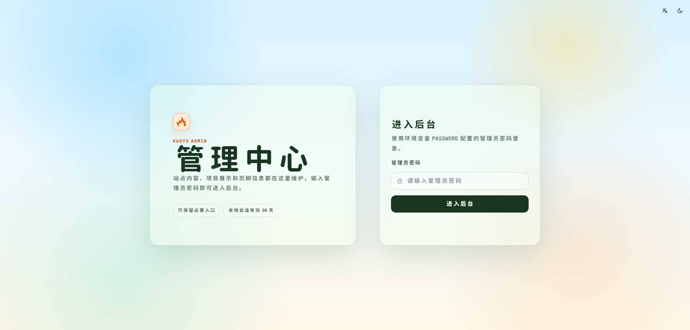

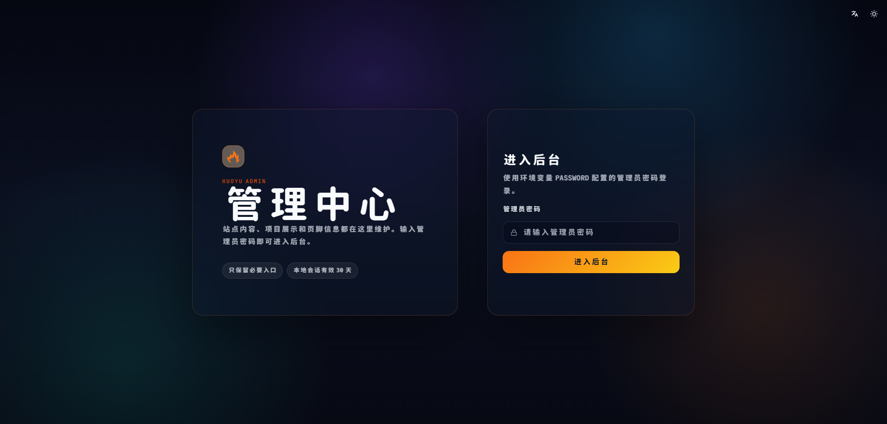

## 技术栈

- Next.js 15 App Router
- React
- TypeScript
- Tailwind CSS
- shadcn/ui 与 Radix UI
- next-themes
- i18next / react-i18next
- Framer Motion
- Recharts
- NextAuth

## 本地启动

```bash
pnpm install
cp .env.example .env.local
pnpm dev
```

启动后访问：

- 前台：`http://localhost:3000`
- 后台：`http://localhost:3000/admin`

后台密码读取环境变量 `PASSWORD`。本地登录状态保存在浏览器本地缓存中，过期后重新输入密码。

## 环境变量

真实密钥只放在 `.env.local` 或部署平台的环境变量中，不要提交到仓库。

| 变量 | 说明 |
| --- | --- |
| `PASSWORD` | 管理后台登录密码 |
| `STEAM_API_KEY` | Steam Web API Key |
| `NETEASE_MUSIC_U` | 网易云音乐登录 Cookie 中的 `MUSIC_U` |
| `NEXTAUTH_SECRET` | NextAuth 会话签名密钥 |
| `GITHUB_TOKEN` | GitHub API Token，用于同步仓库和贡献数据 |
| `WAKATIME_API_KEY` | WakaTime API Key |
| `WEGAME_TGP_ID` | WeGame Cookie 中的 `tgp_id` |
| `WEGAME_COOKIE` | WeGame 完整 Cookie |

WeGame Cookie 获取方式：登录 [WeGame](https://www.wegame.com.cn/)，打开开发者工具，在 Cookie 中查看 `tgp_id`，并复制完整 Cookie 粘贴到环境变量或后台配置中。

## 常用命令

```bash
pnpm dev
pnpm build
pnpm start
```

## 部署

推荐部署到 Vercel 或其他支持 Next.js 的平台。部署时需要在平台后台配置 `.env.example` 中列出的环境变量，尤其是 `PASSWORD`、`NEXTAUTH_SECRET`、`GITHUB_TOKEN`、`WAKATIME_API_KEY` 以及需要展示的第三方服务密钥。

## 目录说明

```text
app/              Next.js App Router 页面与接口
components/       前台与后台组件
lib/              数据处理、缓存、配置和工具函数
public/           静态资源与预览图片
settings.json     本地站点配置数据
```

## 说明

HuoYu 是一个个人站点项目，部分第三方数据依赖对应服务的账号、API Key 或 Cookie。若某个服务未配置，前台会尽量使用已有缓存或隐藏对应数据。
